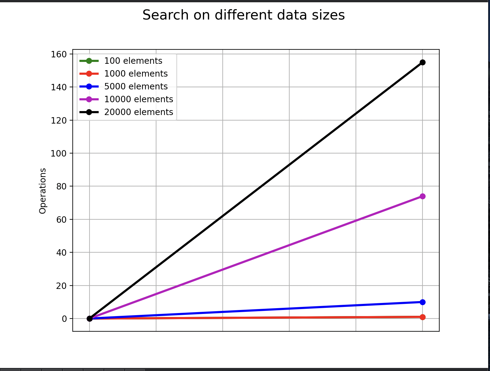

# Hash Table

## Description

In this program I've implemented a basic **_hash-table_** that uses `murmurHash2 `function for hashing

I handle collisions using a single-linked list.

## Time-complexity analysis

| Best case  | Average case   | Worst case |
| ---------- | -------------- | ---------- |
| _T = O(1)_ | _T = O(1 + α)_ | _T = O(n)_ |

## Example of plotted graphs

